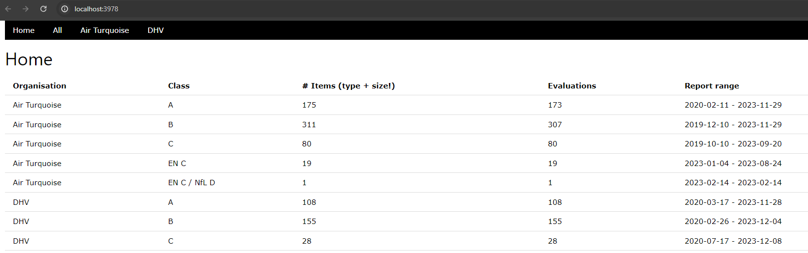
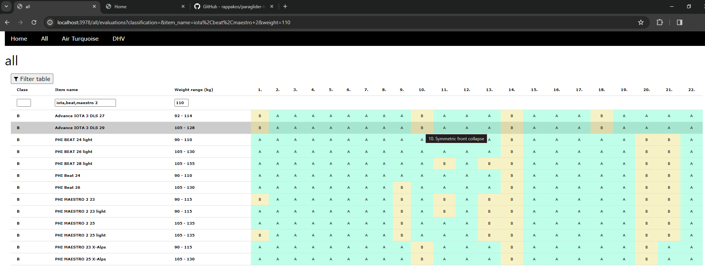

# Evaluation of paraglider certification documents

Tool to easily get new certification data and compare gliders.

## Data

 A,B,C certification tests by DHV or Air Turquoise starting with test dates around 2020-01-01.

###  Air Turquoise

 Air Turquoise provides data over PDF links, most of which can be processed relatively easily. Some files have broken text content that need some additional tricks.

### DHV

The DHV test reports are available as HTML, which can be extracted using standard tools.


## Home - summary of the data



## Paraglider comparisons



### Tesseract 

Some PDF files need to be processed with an OCR tool.

Add `tesseract_cmd` with path to the exe to a `.env` file.


## Running locally (FastAPI)

The project has been migrated to FastAPI. The instructions below intentionally skip database initialization — the app expects an existing `glider_tests.db` when started.

1) Create and activate a virtual environment, then install dependencies:

```powershell
python -m venv .venv
.\.venv\Scripts\Activate.ps1
pip install --upgrade pip
pip install -r requirements.txt
```

2) Copy `.env` from `template.env` if present and edit values such as `PORT` :

```powershell
copy template.env .env
notepad .env
```

3) Start the FastAPI server (development mode with auto-reload):

```powershell
# from repo root
uvicorn main:app --reload --host 127.0.0.1 --port 3978
```

4) Open the app in your browser:

- UI: `http://127.0.0.1:3978/`
- API docs (Swagger): `http://127.0.0.1:3978/docs`

Notes:
- Database setup is intentionally skipped here. If you don't have a DB file, create or copy one next to the repository root (file name `glider_tests.db`) in `.env`.
- If you still want to run the legacy aiohttp app while migrating, run `python app.py` instead.
- For scrapers that use Selenium, ensure Chrome is installed; `webdriver-manager` will manage the ChromeDriver.

### Run on Android

* install Termux (with F-Droid)
* install Termux:Widget (with F-Droid)
* check out this repo in Termux
* install python requirements
* copy a `glider_tests.db` next to the `app.py` file
* create `.shortcuts/tasks/pg-test.bash` in ~ with following:
 ** cd <github folder>/paraglider-tests;
 ** python app.py
* add shortcut with the termux widget to the screen
* go to 
http://localhost:3978/


