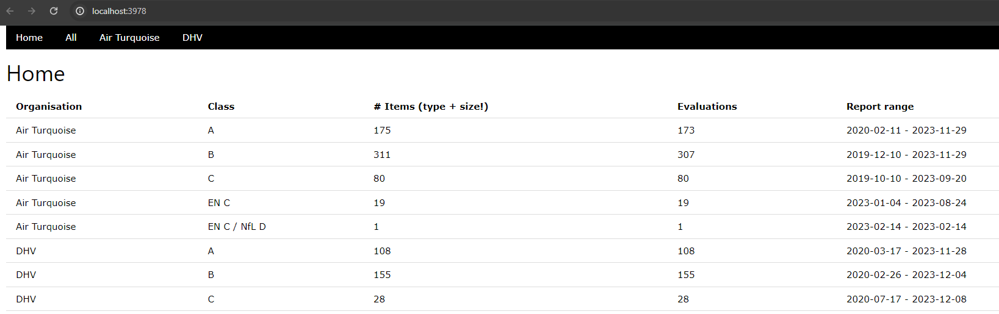
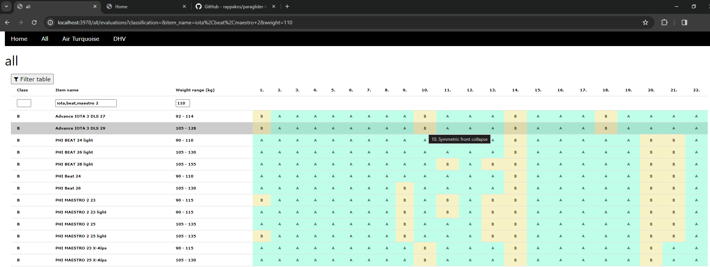

# Evaluation of paraglider certification documents

Tool to easily get new certification data and compare gliders.

## Data

 A,B,C certification tests by DHV or Air Turquoise starting with test dates around 2020-01-01.

###  Air Turquoise

 Air Turquoise provides data over PDF links, most of which can be processed relatively easily. Some files have broken text content that need some additional tricks.

### DHV

The DHV test reports are available as HTML, which can be extracted using standard tools.


## Home - summary of the data



## Paraglider comparisons



### OCR for Air Turquoise PDFs

Some Air Turquoise PDF files have broken text extraction and fall back to OCR.

On Linux, install both Tesseract and Poppler first:

```bash
sudo apt install tesseract-ocr poppler-utils
```

`pytesseract` will use `tesseract` from your `PATH` by default, so a `.env` entry is usually not needed on Linux.

If autodiscovery fails, add this to `.env`:

```dotenv
tesseract_cmd=/usr/bin/tesseract
```

On Windows, keep using the full `tesseract.exe` path in `.env`.


## Running locally (FastAPI)

The project has been migrated to FastAPI. The instructions below intentionally skip database initialization — the app expects an existing `glider_tests.db` when started.

1) Create and activate a virtual environment, then install dependencies:

Linux / macOS:

```bash
python -m venv .venv
source .venv/bin/activate
pip install --upgrade pip
pip install -r requirements.txt
```

Windows PowerShell:

```powershell
python -m venv .venv
.\.venv\Scripts\Activate.ps1
pip install --upgrade pip
pip install -r requirements.txt
```

2) Create a `.env` file if needed:

Linux / macOS:

```bash
touch .env
```

Windows PowerShell:

```powershell
# Optional: create .env for custom configuration
notepad .env
```

3) Start the FastAPI server (development mode with auto-reload):

```powershell
# from repo root
uvicorn main:app --reload --host 127.0.0.1 --port 3978
```

4) Open the app in your browser:

- UI: `http://127.0.0.1:3978/`
- API docs (Swagger): `http://127.0.0.1:3978/docs`

Notes:
- Database setup is intentionally skipped here. The app expects an existing `glider_tests.db` file in the repository root.
- The app uses Playwright for web scraping. Playwright will download necessary browser binaries automatically on first use.
- Air Turquoise OCR additionally requires the system packages `tesseract-ocr` and `poppler-utils` on Debian-based Linux systems such as Linux Mint.

### Run on Android

* install Termux (with F-Droid)
* install Termux:Widget (with F-Droid)
* check out this repo in Termux
* install python requirements
* copy a `glider_tests.db` next to the `main.py` file
* create `.shortcuts/tasks/pg-test.bash` in ~ with following:
 ** cd <github folder>/paraglider-tests;
 ** uvicorn main:app --host 127.0.0.1 --port 3978
* add shortcut with the termux widget to the screen
* go to 
http://localhost:3978/


